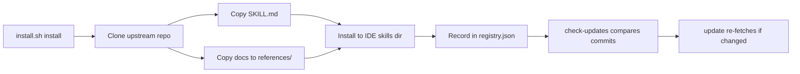

# How Skills Work

## The Agent Skills Standard

This project uses the [Agent Skills open standard](https://agentskills.io/) (`SKILL.md` format) — a portable way to provide contextual knowledge to AI coding assistants.

Each skill is a directory containing:

```
skill-name/
  SKILL.md              # YAML frontmatter + Markdown instructions
  references/           # Documentation fetched from upstream
    REFERENCE.md        # Index of available documents
    setup.adoc          # Actual docs from the source repo
    ...
  scripts/              # Optional automation scripts
```

## How the AI Uses Skills

When you ask your AI assistant about a topic covered by a skill, the assistant:

1. **Detects relevance** from the `SKILL.md` frontmatter (name, description, "When to Use" section)
2. **Reads instructions** from the Markdown body
3. **Consults references** in the `references/` directory for detailed docs
4. **Follows conventions** from the skill's best practices

## Dual-Mode: Skills + Rules

For Cursor IDE, skills can also install `.mdc` rule files to `.cursor/rules/`. These rules are:

- **Glob-scoped**: Only activate when editing files matching specific patterns
- **Convention-enforcing**: Remind the AI about project-specific patterns
- **Optional**: Skills work without rules; rules add Cursor-specific enhancements

## Skill Lifecycle



## The Registry

Installed skills are tracked in `~/.rhel-devops-skills/registry.json`:

```json
{
  "version": "1.0",
  "auto_check_updates": true,
  "installed_skills": [
    {
      "name": "agnosticd",
      "source_repo": "https://github.com/agnosticd/agnosticd-v2",
      "docs_commit_hash": "abc123...",
      "installed_to": [
        {"ide": "claude", "path": "~/.claude/skills/agnosticd"},
        {"ide": "cursor", "path": "~/.cursor/skills-cursor/agnosticd"}
      ]
    }
  ]
}
```
